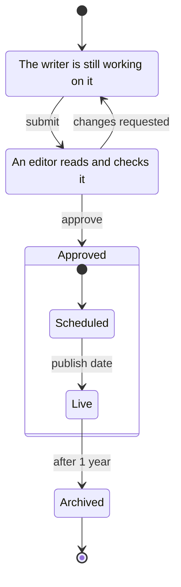

# The life of an article

Every article moves through a few clear stages before readers see it.

```mermaid
stateDiagram-v2
    [*] --> Draft
    Draft --> Review : submit
    Review --> Draft : changes requested
    Review --> Approved : approve
    state Approved {
        [*] --> Scheduled
        Scheduled --> Live : publish date
    }
    Live --> Archived : after 1 year
    Archived --> [*]
    Draft : The writer is still working on it
    Review : An editor reads and checks it
```
