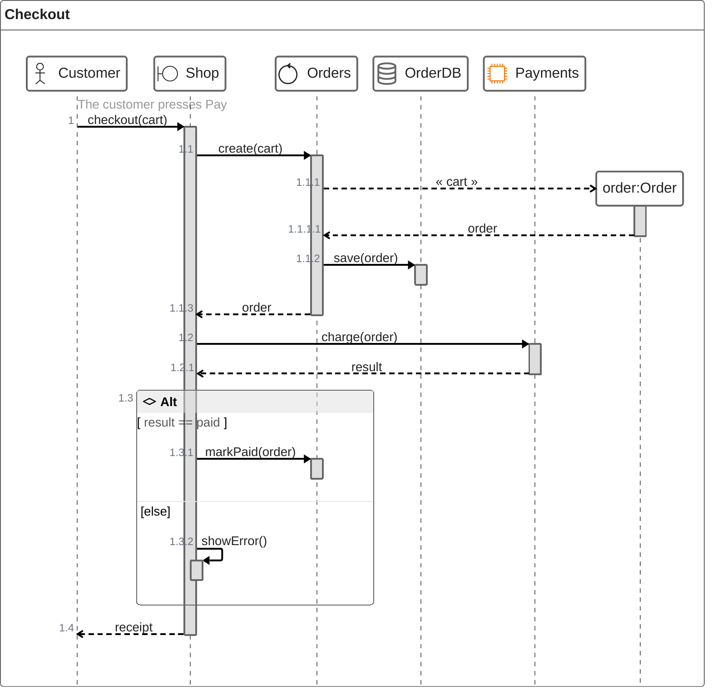

# What happens when a customer checks out

```mermaid
zenuml
    title Checkout
    @Actor Customer
    @Boundary Shop
    @Control Orders
    @Database OrderDB
    @EC2 Payments
    @Starter(Customer)
    // The customer presses Pay
    Shop.checkout(cart) {
      Orders.create(cart) {
        order = new Order(cart)
        OrderDB.save(order)
        return order
      }
      result = Payments.charge(order)
      if(result == paid) {
        Orders.markPaid(order)
      } else {
        Shop.showError()
      }
      return receipt
    }
```

- **Payments**: Card details go straight to the payment provider; the shop never stores them.
