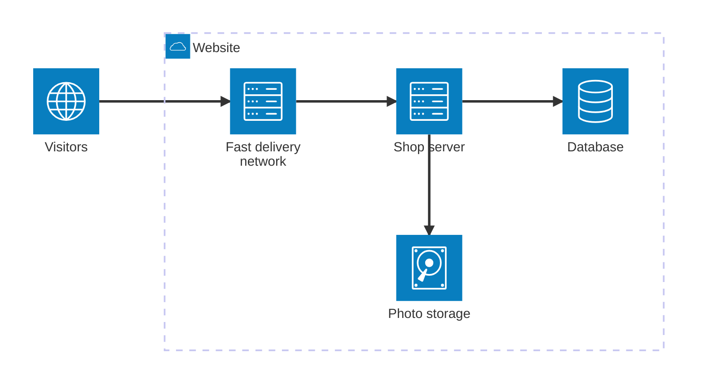

# How the shop runs in the cloud

```mermaid
architecture-beta
    group web(cloud)[Website]
    service visitor(internet)[Visitors]
    service cdn(server)[Fast delivery network] in web
    service app(server)[Shop server] in web
    service db(database)[Database] in web
    service files(disk)[Photo storage] in web
    visitor:R --> L:cdn
    cdn:R --> L:app
    app:R --> L:db
    app:B --> T:files
```
