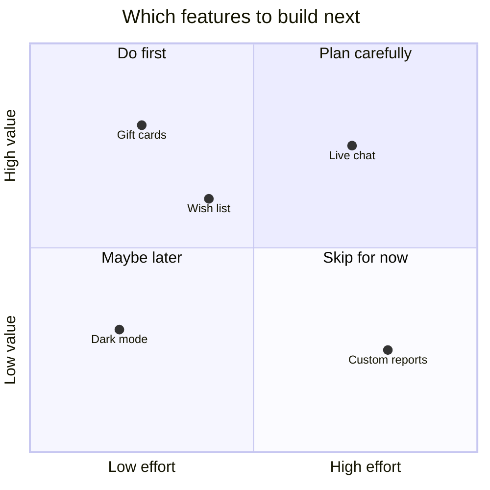

# Which features to build next

Each feature is placed by how much work it is and how much it helps customers.

```mermaid
quadrantChart
    title Which features to build next
    x-axis Low effort --> High effort
    y-axis Low value --> High value
    quadrant-1 Plan carefully
    quadrant-2 Do first
    quadrant-3 Maybe later
    quadrant-4 Skip for now
    Gift cards: [0.25, 0.8]
    Wish list: [0.4, 0.62]
    Live chat: [0.72, 0.75]
    Dark mode: [0.2, 0.3]
    Custom reports: [0.8, 0.25]
```
