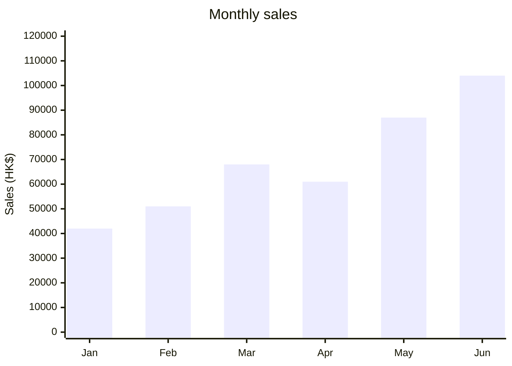

# Online shop sales this year

Monthly sales, in Hong Kong dollars.

```mermaid
xychart-beta
    title "Monthly sales"
    x-axis [Jan, Feb, Mar, Apr, May, Jun]
    y-axis "Sales (HK$)" 0 --> 120000
    bar [42000, 51000, 68000, 61000, 87000, 104000]
```
