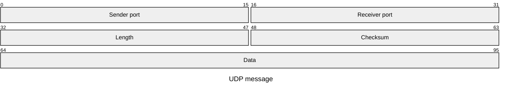

# What's inside a UDP message

Every message sent over the network starts with a small header.

```mermaid
packet-beta
    title UDP message
    0-15: "Sender port"
    16-31: "Receiver port"
    32-47: "Length"
    48-63: "Checksum"
    64-95: "Data"
```
