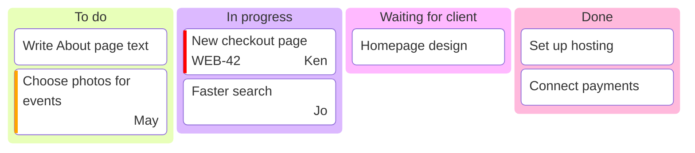

# Where the website project stands

```mermaid
kanban
  todo[To do]
    t1[Write About page text]
    t2[Choose photos for events]@{ assigned: 'May', priority: 'High' }
  doing[In progress]
    d1[New checkout page]@{ assigned: 'Ken', priority: 'Very High', ticket: WEB-42 }
    d2[Faster search]@{ assigned: 'Jo' }
  review[Waiting for client]
    r1[Homepage design]
  done[Done]
    x1[Set up hosting]
    x2[Connect payments]
```
