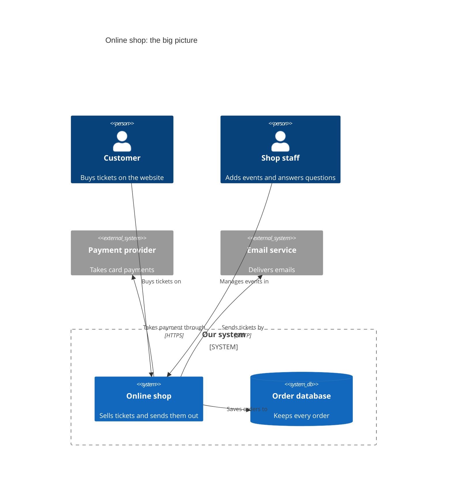

# Who uses the online shop

```mermaid
C4Context
    title Online shop: the big picture
    Person(customer, "Customer", "Buys tickets on the website")
    Person(staff, "Shop staff", "Adds events and answers questions")
    System_Boundary(ours, "Our system") {
        System(shop, "Online shop", "Sells tickets and sends them out")
        SystemDb(db, "Order database", "Keeps every order")
    }
    System_Ext(pay, "Payment provider", "Takes card payments")
    System_Ext(mail, "Email service", "Delivers emails")
    Rel(customer, shop, "Buys tickets on")
    Rel(staff, shop, "Manages events in")
    Rel(shop, db, "Saves orders to")
    Rel(shop, pay, "Takes payment through", "HTTPS")
    Rel(shop, mail, "Sends tickets by", "SMTP")
```
