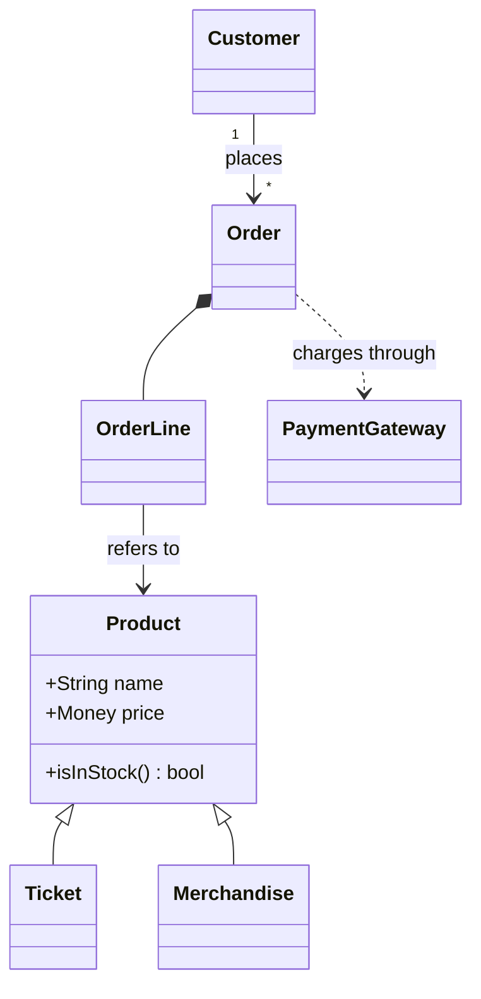

# What the shop system knows about

```mermaid
classDiagram
    class Product {
        +String name
        +Money price
        +isInStock() bool
    }
    class Ticket
    class Merchandise
    Product <|-- Ticket
    Product <|-- Merchandise
    Customer "1" --> "*" Order : places
    Order *-- OrderLine
    OrderLine --> Product : refers to
    Order ..> PaymentGateway : charges through
```
