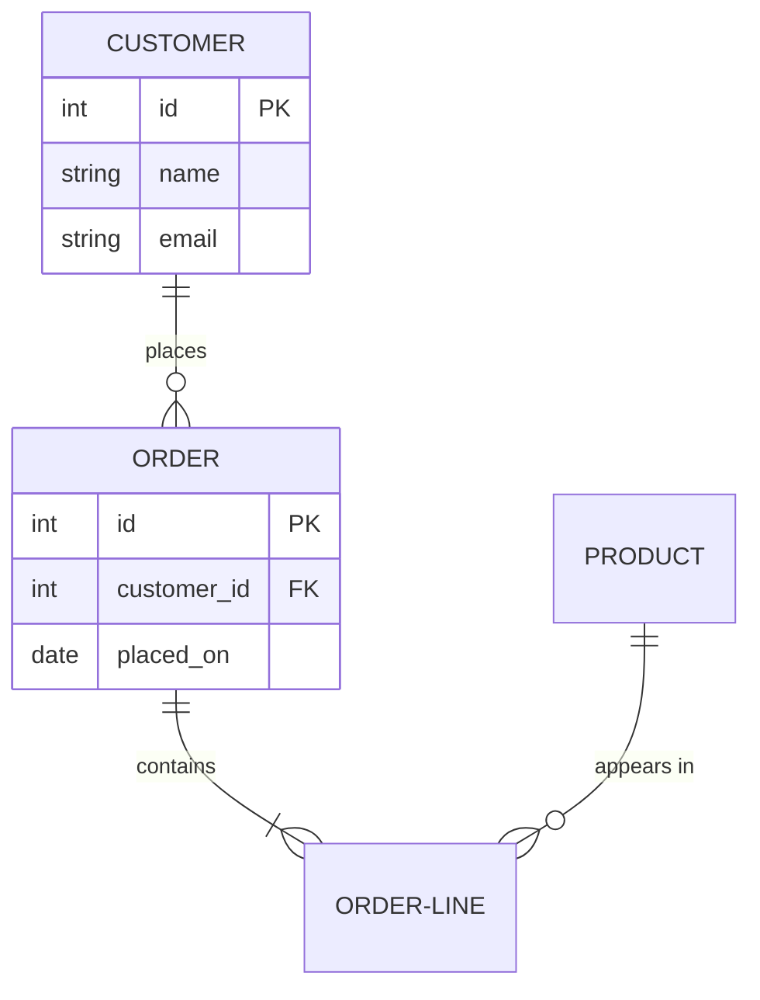

# How the shop's data fits together

```mermaid
erDiagram
    CUSTOMER ||--o{ ORDER : places
    ORDER ||--|{ ORDER-LINE : contains
    PRODUCT ||--o{ ORDER-LINE : "appears in"
    CUSTOMER {
        int id PK
        string name
        string email
    }
    ORDER {
        int id PK
        int customer_id FK
        date placed_on
    }
```
