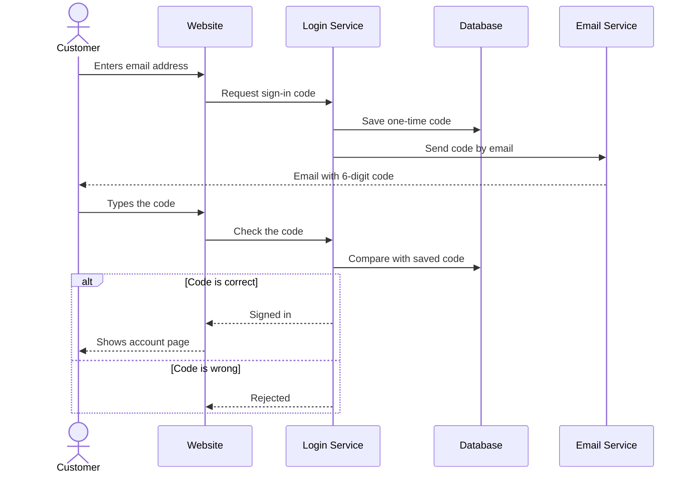

# Signing in with a one-time code

```mermaid
sequenceDiagram
  actor U as Customer
  participant W as Website
  participant A as Login Service
  participant D as Database
  participant E as Email Service
  U->>W: Enters email address
  W->>A: Request sign-in code
  A->>D: Save one-time code
  A->>E: Send code by email
  E-->>U: Email with 6-digit code
  U->>W: Types the code
  W->>A: Check the code
  A->>D: Compare with saved code
  alt Code is correct
    A-->>W: Signed in
    W-->>U: Shows account page
  else Code is wrong
    A-->>W: Rejected
  end
```

- **Login Service**: Codes expire after 10 minutes and can be used only once.
