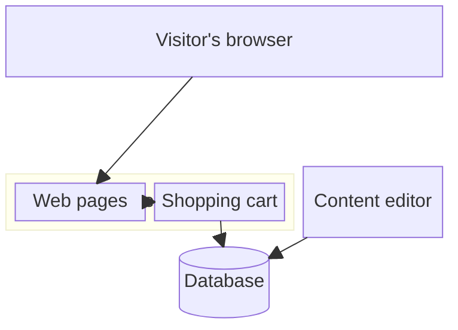

# The parts of the website

```mermaid
block-beta
    columns 3
    browser["Visitor's browser"]:3
    space:3
    block:shop["Online shop"]:2
        columns 2
        pages["Web pages"] cart["Shopping cart"]
    end
    cms["Content editor"]
    db[("Database")]:3
    browser --> pages
    pages --> cart
    cart --> db
    cms --> db
```
